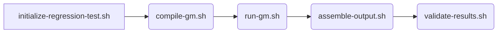

# Regression Test

To support the development of GEM-MACH, a regression test framework has
been implemented. It comprises a series of scripts that automate the
compilation, execution, and validation of model results, ensuring
consistent performance and reproducibility across code changes.

## Design

The regression test operates through five distinct stages:
1. Initiation: Prepares the GEM-MACH source code, sets up the necessary
   directory structure for model execution, and generates configuration
   files required for subsequent stages.
2. Compilation: Compiles the freshly prepared GEM-MACH source code.
3. Execution: Runs a short GEM-MACH experiment using a small test grid
   and pre-existing input files that were used to generate the control
   output.
4. Output Assembly: Gathers and organizes the model output generated
   during the test run.
5. Validation: Compares the assembled output against the control output
   to verify consistency.

Each stage is executed by a dedicated script located in the
`tools/regression-test` directory. The testing process begins with the
initialization script and proceeds automatically through the sequence
illustrated in the graph below:


## Preprocessed I/O

### Default I/O
The preprocessed input files required for running GEM-MACH in the
regression test, along with the corresponding control outputs, are
available in the directory:
`/fs/site[56]/eccc/aq/r1/sarq000/gmtest/${test_version}`

### Optional Local I/O
A directory with `gm-input` and `gm-output` subdirectories containing
preprocessed input and control output files can be provided as an option.

## Optional Local Configuration
`tools/gemmach_cfg` directory in MACH repository is a place-holder for
local version of GEM-MACH configuration in the regression test.

Regardless of the choice of options, if any of the three configuration
files (i.e. `gm_phy_intable`, `gem_settings.nml`, and/or `outcfg.out`)
are saved in `tools/gemmach_cfg`, they will be used instead of the ones
provided in the control input directory.

## Expected Results of Successful Execution

- Initialization Stage
If the GEM-MACH source code is built successfully, the initialization
script stores the code in the directory:
`gm-test-${TRUE_HOST}_${latest_commit}/GEM-MACH`.

- Compilation Stage
If compilation completes successfully, the resulting executable is saved to:
gm-test-${TRUE_HOST}_${latest_commit}/bin/maingemdm.

- Execution Stage
The GEM-MACH run can be monitored in the directory:
`gm-test-${TRUE_HOST}_${latest_commit}/work/tmpdir*`
Output files specific to each processor can be found under:
`gm-test-${TRUE_HOST}_${latest_commit}/output/cfg_0000/laststep_0000*/*`.

- Validation Stage
If the regression test confirms that the output matches the control
output, the validation script records the message:
`New binary reproduces reference output.` in two listing files
`gm-test-${TRUE_HOST}_${latest_commit}/listings/vldtgm*out` and
`gm-test-${TRUE_HOST}-info.txt_${latest_commit}`

- Optional: Control Output Generation
If the regression test is configured to prepare new control output and
the output assembly is successful, new control is a directory to which
`gm-test-${TRUE_HOST}_${latest_commit}` link points.

- Listings
Most important information from each stage is saved in
`gm-test-${TRUE_HOST}-info.txt_${latest_commit}` file.
Additionally, all but initiation stages save listings in
`gm-test-${TRUE_HOST}_${latest_commit}/listings/*out` files.
To save the listings of initiation stage:
```
tools/regression-test/initialize-regression-test.sh | tee gm-test-${TRUE_HOST}-listings.txt_$(git rev-parse --verify --short HEAD)
```

## Applications

Beyond verifying that the control output is reproduced, the regression
test also supports a range of additional functions:
- Automated build of GEM-MACH source code from the MACH subtree repository
- Automated compilation of GEM-MACH
- Compilations of multiple GEM-MACH binaries from a single GEM or MACH
  local repository
- Debugging of GEM-MACH
- Automated creation of ssm packages containing the GEM-MACH binary
- GitLab Continuous Integration (CI)\*

To enable this versatility, the initialization script is designed to
select options based on provided arguments and store those choices in
configuration files for use by the subsequent scripts.

To view the full list of available arguments, run the following command
from either the root of the MACH subtree repository or from the
`src/mach` directory in the GEM super repository:
```
tools/regression-test/initialize-regression-test.sh -h
```

\* Note: Although the CI pipeline invokes each script individually, it
follows the execution order described above.

## Usage Examples

While in the appropriate directory, you can run the script with various
options depending on your needs. Below are few examples:

### Basic Execution:
- From the local MACH repository with history different from MACH
history in MIG/gem super repo:
```
tools/regression-test/initialize-regression-test.sh -m -u
```
- From `src/mach` in GEM super repository:
```
tools/regression-test/initialize-regression-test.sh
```

### Create a Custom Control Directory
```
tools/regression-test/initialize-regression-test.sh -n
```

### Use a Custom Control Directory
```
tools/regression-test/initialize-regression-test.sh -l LOCAL_DIRECTORY_PATH
```
Replace `LOCAL_DIRECTORY_PATH` with the path to the desired control
directory (e.g. a true path of `gm-test-${TRUE_HOST}_${latest_commit}`
link created with `-n` option).

### Combine Multiple Options in a Single Command
For example, to enable debug mode, both tracing options, new control
files, a custom control directory, use of a local MACH repo with
different history, use of GEM super repository and different from
`MIG/gem` with branch or tag different from `GEM_version` defined in
`MANIFEST`, while also saving the listing to a file:
```
tools/regression-test/initialize-regression-test.sh -d -c -p -n -l LOCAL_DIRECTORY_PATH -m -u -g GEM_remote,GEM_version 2>&1 > gm-test-${TRUE_HOST}-listings.txt_$(git rev-parse --verify --short HEAD)
```
Replace `LOCAL_DIRECTORY_PATH` as above, and `GEM_remote,GEM_version`
with comma-separated location of the desired GEM super repository and
the branch or tag.

### In GitLab CI
Review `.gitlab-ci.yml` file

